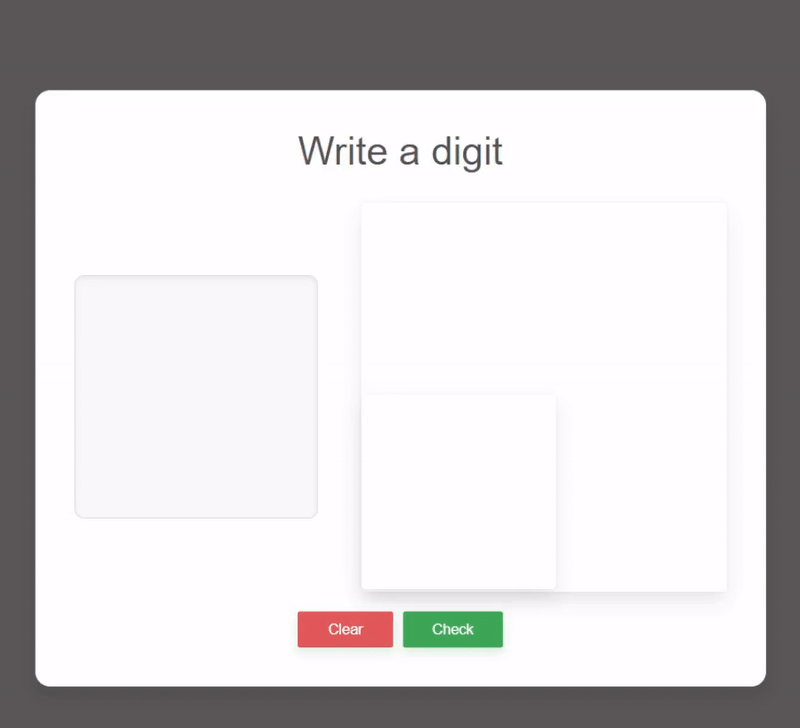
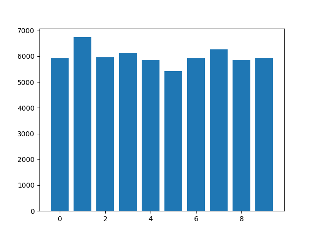
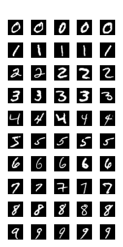
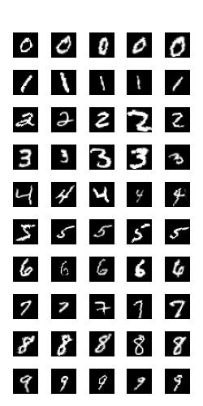

# handwritten-digit-recognition-cnn
A handwritten recognition app using deep learning

This is a simple Flask web application which accepts a handwritten digit and predicts the digit. Behind the hood is an ensemble of 3 different CNN models. These models are trained using MNIST dataset. One of the three models is trained using samples from MNIST dataset after augmentation. 

 ## User Interface



## Dataset
The MNIST dataset comprises:

Training Set: 60,000 images
Testing Set: 10,000 images 
Each image is 28x28 pixels, representing a single digit from 0 to 9.



This graph shows the distribution of the classes (digits from 0 to 9).



This is the glimpse of the random samples from the dataset



This is the glimpse of the random samples from the dataset after augmentation

The following is the code for augmentation:
```
transform = transforms.Compose([
    transforms.RandomRotation(10),  # Rotate the image slightly
    transforms.RandomAffine(0, shear=10, scale=(0.8, 1.2)),  # Add affine transformations
    transforms.RandomPerspective(distortion_scale=0.2, p=0.5),  # Distort perspective
    transforms.ToTensor()
])
```


## Model Architecture
### Model 1

---

#### Layer Summary

| Layer (Type)      | Output Shape         | Param #      |
|--------------------|----------------------|--------------|
| Conv2d-1          | [-1, 64, 28, 28]    | 640          |
| ReLU-2            | [-1, 64, 28, 28]    | 0            |
| Conv2d-3          | [-1, 128, 28, 28]   | 73,856       |
| ReLU-4            | [-1, 128, 28, 28]   | 0            |
| MaxPool2d-5       | [-1, 128, 14, 14]   | 0            |
| Dropout-6         | [-1, 128, 14, 14]   | 0            |
| Linear-7          | [-1, 250]           | 6,272,250    |
| ReLU-8            | [-1, 250]           | 0            |
| Dropout-9         | [-1, 250]           | 0            |
| Linear-10         | [-1, 10]            | 2,510        |

---

#### Total Parameters

- **Trainable Parameters**: 6,349,256  

---

#### Test Accuracy

**98.95%**


### Model 2

---

#### Layer Summary

| Layer (Type)      | Output Shape         | Param #      |
|--------------------|----------------------|--------------|
| Conv2d-1          | [-1, 32, 28, 28]    | 320          |
| MaxPool2d-2       | [-1, 32, 14, 14]    | 0            |
| Conv2d-3          | [-1, 64, 14, 14]    | 18,496       |
| MaxPool2d-4       | [-1, 64, 7, 7]      | 0            |
| Linear-5          | [-1, 128]           | 401,536      |
| Linear-6          | [-1, 10]            | 1,290        |

---

#### Total Parameters

- **Trainable Parameters**: 421,642  

---

#### Test Accuracy - **98.99%**


### Model 3 
same as Model 2 trained using augmented dataset
#### Test Accuracy - **98.62%**

## Limits and scope for future improvement
- The model is learning the position of the digits in the canvas rather than the shape. This could possibly be solved by training the models using an augmentation where there is displacement in the image.
- Though the accuracy for each model is around 98.5%, there is a lot of error when it comes to the images that do not belong to the dataset. The app can have a database where the digits entered in the canvas are stored and periodically used for training
- The interface can have a display of accuracy for the predictions done by the app.


## Built with

Python 3.8.1 - The main programming language used
Pytorch- for training models
Flask for Back-end,
Chart-JS for generating charts


