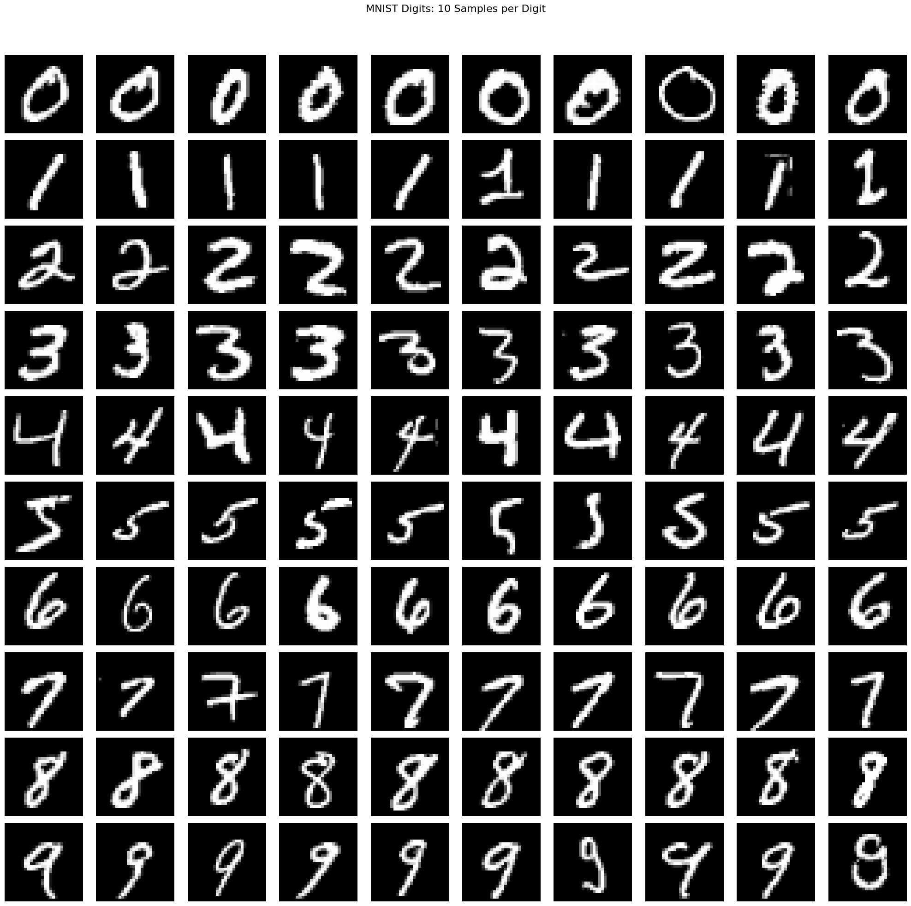

# handwritten-digit-recognition-cnn
A handwritten recognition app using deep learning

This is a simple Flask web application which accepts a handwritten digit and predicts the digit. The prediction is done using a basic Convolutional Neural Network. This cnn model is trained using MNIST dataset using pytorch. 

## Dataset
The MNIST dataset comprises:

Training Set: 60,000 images
Testing Set: 10,000 images 
Each image is 28x28 pixels, representing a single digit from 0 to 9.

## Model Architecture
The recognition system uses 2 CNN models trained using the same dataset.The final prediction is the average of their predictions during inference.

- Convolutional Layers: Extract spatial features from the images.
- Pooling Layers: Reduce dimensionality while preserving important features.
- Fully Connected Layers: Map the extracted features to digit classes.
- Dropout Layers: Prevent overfitting by randomly deactivating neurons during training.
